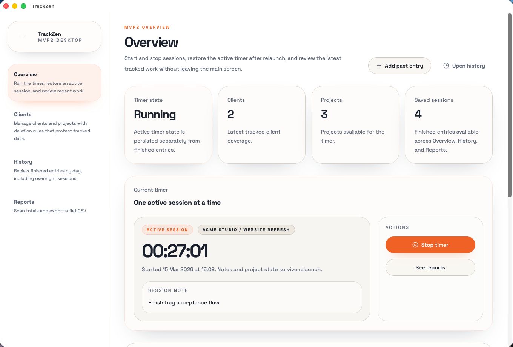
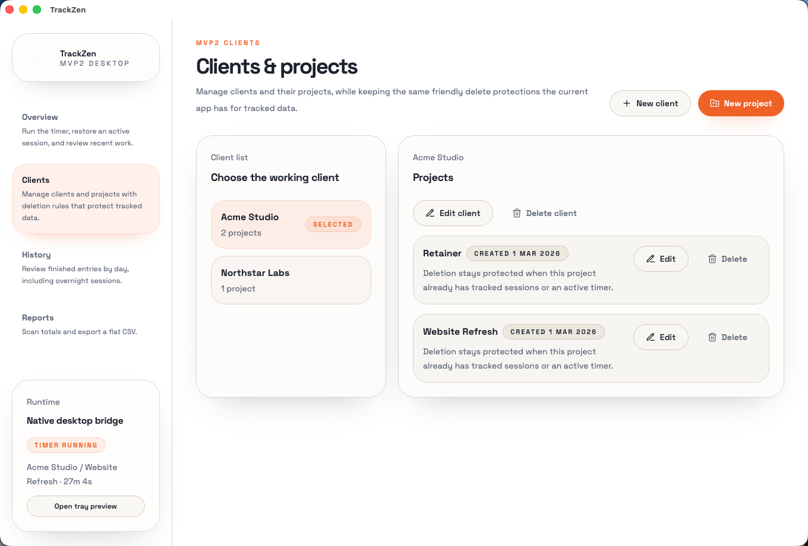
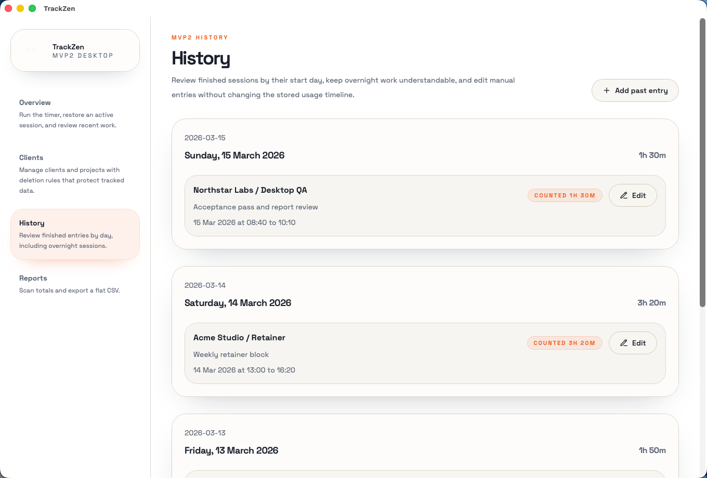
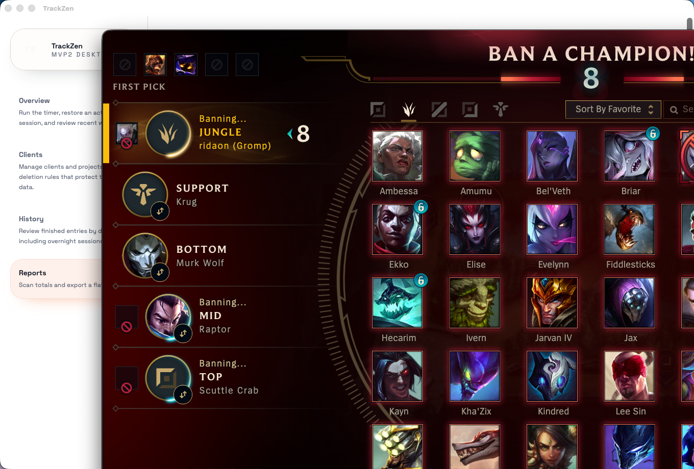
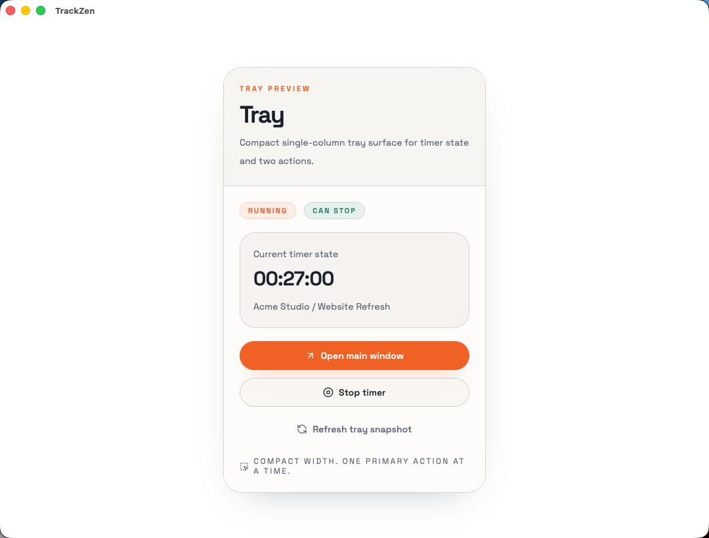

# ZenTrack

ZenTrack is a local-first desktop time tracker for client and project work.

This public repository is the download and release-notes surface for alpha releases. The application source code remains private.

## Current Release

- Version: `0.2.1 alpha`
- Release tag: `v0.2.1-alpha`
- Download page: [Latest release](https://github.com/ridala/zentrack-download/releases/latest)

## Screenshots

### Overview

### Clients

### History

### Reports

### Tray

## What ZenTrack Includes

- overview timer flow: start, pause, resume, stop
- clients and projects with full CRUD
- project software rules and ignored-time filtering
- history with day-grouped review, manual entries, overnight sessions, and app-usage detail
- reports with totals, by-client, by-day, and by-project rows
- CSV export from the reports page and the native menu
- tray access for timer state, open-main, and stop-timer actions
- settings for idle detection and auto-pause
- native activity tracking on macOS

## Installers

Release assets are uploaded to GitHub Releases instead of being committed into this repository.

Check the assets attached to this release tag for the actual artifacts published for this build.

### macOS

- `ZenTrack-0.2.1-macos-arm64.dmg` — Apple Silicon

## Notes

- ZenTrack is a macOS desktop app
- alpha release builds are unsigned and not notarized
- macOS Gatekeeper will show a warning on first launch; right-click and select Open to bypass
- public README images use stable repo-relative paths
- this repository should never contain source code, secrets, or build caches
